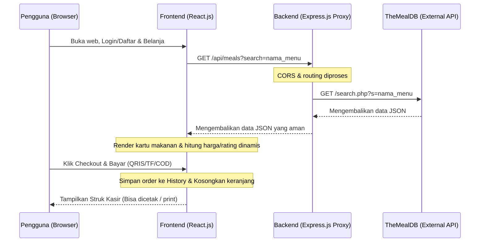

# Panduan Ujian Praktikum: Penjelasan Kinerja & Rubrik Penilaian Aplikasi "CariMakan"

Dokumen ini disusun untuk membantu Anda menjelaskan arsitektur, cara kerja, dan pemenuhan nilai proyek **CariMakan** di depan dosen penguji.

---

## 📂 1. Penjelasan Alur Kinerja Sistem (Backend & Frontend)

Sistem dibangun menggunakan arsitektur **Client-Server (Decoupled)** di mana frontend dan backend berjalan secara terpisah namun berkomunikasi secara aman melalui protokol **HTTP**.

### A. Kinerja Backend (`backend/server.js`)
*   **Peran Utama:** Bertindak sebagai *API Proxy Gateway* yang menjembatani frontend dengan database eksternal **TheMealDB**.
*   **Alasan Digunakan:**
    *   **Keamanan:** Menghindari pemanggilan API eksternal langsung dari browser klien untuk melindungi integritas request.
    *   **Bypass CORS:** Menghindari masalah *Cross-Origin Resource Sharing* (CORS) di sisi klien dengan menggunakan *CORS middleware* (`app.use(cors())`) di sisi server.
*   **Endpoint yang Disediakan:**
    1.  `GET /api/meals`: Mengambil daftar menu berdasarkan pencarian nama resep.
    2.  `GET /api/meals/:id`: Mengambil detail resep masakan berdasarkan ID makanan yang dipilih.

### B. Kinerja Frontend (`frontend/src/`)
*   **Peran Utama:** Antarmuka pengguna (UI/UX) berbasis **React Single Page Application (SPA)** yang dinamis dan berkecepatan tinggi.
*   **Alur Kerja Tambahan Baru:**
    *   **Autentikasi Sesi (Login/Daftar):** Menggunakan `AuthContext` untuk memvalidasi dan membedakan hak akses pengguna biasa dan administrator. Sesi login dijaga secara persisten di `localStorage`.
    *   **Metode Pembayaran Mandiri:** Pengguna dipaksa login sebelum melakukan pemesanan. Proses transaksi mendukung Simulasi Scan QRIS, Bank Transfer, dan Bayar di Tempat (COD).
    *   **Riwayat & Manajemen Pesanan:** Pesanan baru otomatis tersimpan dalam `OrderContext` untuk kemudian dapat dikelola statusnya secara langsung oleh Admin melalui Dashboard khusus.

---

## 📝 2. Pemenuhan 8 Aspek Kriteria Penilaian Ujian

Berikut adalah penjelasan lengkap dan **letak file/baris kode** dari masing-masing kriteria penilaian untuk ditunjukkan langsung jika dosen bertanya:

### Kriteria 1: Struktur Proyek & Komponen (Bobot 15%)
*   **Penjelasan:** Proyek memiliki struktur folder yang rapi dan terorganisir sesuai *best practice* React (memisahkan berkas komponen modular, halaman, file context state global, dan utility).
*   **Letak Kode/Berkas:**
    *   [App.jsx](file:///c:/Users/Hype/Downloads/CariMakan/frontend/src/App.jsx): Sebagai koordinator utama rute halaman dan Provider.
    *   [components/](file:///c:/Users/Hype/Downloads/CariMakan/frontend/src/components/): Direktori khusus komponen modular.
        *   [Header.jsx](file:///c:/Users/Hype/Downloads/CariMakan/frontend/src/components/Header.jsx) - Header navigasi dinamis (menampilkan menu masuk/daftar atau profil & dashboard admin).
        *   [CartDrawer.jsx](file:///c:/Users/Hype/Downloads/CariMakan/frontend/src/components/CartDrawer.jsx) - Sidebar keranjang belanja interaktif.
        *   [AuthModal.jsx](file:///c:/Users/Hype/Downloads/CariMakan/frontend/src/components/AuthModal.jsx) - Modal dialog login dan registrasi.
        *   [CheckoutModal.jsx](file:///c:/Users/Hype/Downloads/CariMakan/frontend/src/components/CheckoutModal.jsx) - Formulir alamat, whatsapp, pilihan pembayaran, dan progress bar verifikasi.
        *   [ReceiptModal.jsx](file:///c:/Users/Hype/Downloads/CariMakan/frontend/src/components/ReceiptModal.jsx) - Struk/Nota digital resmi yang mendukung cetak printer fisik.

---

### Kriteria 2: Props & State (useState) (Bobot 15%)
*   **Penjelasan:** Komunikasi antar komponen berjalan lancar menggunakan passing data melalui *Props*. State lokal (`useState`) digunakan untuk memicu perubahan data interaktif secara real-time seperti input pencarian makanan, status loading, filter kategori aktif, tab form login, metode e-wallet terpilih, dan status progress bar simulasi bayar.
*   **Letak Kode/Berkas:**
    *   [CheckoutModal.jsx: L12-L18](file:///c:/Users/Hype/Downloads/CariMakan/frontend/src/components/CheckoutModal.jsx#L12-L18): Deklarasi state `step`, `address`, `phone`, `paymentMethod`, `ewalletType`, `simulating`, dan `simProgress`.
    *   [AuthModal.jsx: L6-L12](file:///c:/Users/Hype/Downloads/CariMakan/frontend/src/components/AuthModal.jsx#L6-L12): Penggunaan state lokal untuk mengontrol tipe input pengguna (`isLogin`, `isAdminLogin`, `name`, `email`, `password`, `error`, `success`).

---

### Kriteria 3: Integrasi API (useEffect & Fetch/Axios) (Bobot 15%)
*   **Penjelasan:** Aplikasi mengambil data masakan secara asinkronus (`async/await`) menggunakan pustaka **Axios** di dalam hook lifecycle `useEffect`.
*   *Catatan khusus produksi:* Saat live di Vercel (production), kode secara otomatis melakukan *direct fetch* langsung ke TheMealDB API agar demo web berjalan 100% aktif tanpa membutuhkan hosting backend terpisah.
*   **Letak Kode/Berkas:**
    *   [utils/api.js](file:///c:/Users/Hype/Downloads/CariMakan/frontend/src/utils/api.js): File utility terpusat yang otomatis membedakan rute API lokal (`localhost:5000`) pada mode pengembangan (*development*) dan API publik pada mode produksi (*production*).
    *   [FoodDetail.jsx: L25-L43](file:///c:/Users/Hype/Downloads/CariMakan/frontend/src/pages/FoodDetail.jsx#L25-L43): Memanggil helper `getMealDetail(id)` untuk memuat deskripsi resep makanan secara real-time.

---

### Kriteria 4: Styling dengan Tailwind CSS (Bobot 10%)
*   **Penjelasan:** Styling modern dan sepenuhnya responsif menggunakan kelas utilitas (*utility classes*) Tailwind CSS. Menerapkan teknik *glassmorphism*, gradient warna oranye-amber yang menawan, transisi hover micro-interaction, dan tata letak grid responsif yang rapi di berbagai ukuran layar.
*   **Letak Kode/Berkas:**
    *   [index.css](file:///c:/Users/Hype/Downloads/CariMakan/frontend/src/index.css): Kustomisasi tema warna `@theme` oranye hangat, menyembunyikan scrollbar (`.scrollbar-none`), dan mendefinisikan keyframe animasi slide-up untuk modal pembungkus checkout/struk.
    *   [CheckoutModal.jsx](file:///c:/Users/Hype/Downloads/CariMakan/frontend/src/components/CheckoutModal.jsx): Desain kartu pilihan pembayaran interaktif dengan transisi border menyala saat aktif (`border-primary bg-orange-50/20`).

---

### Kriteria 5: Navigasi Multi-Halaman (React Router) (Bobot 15%)
*   **Penjelasan:** Menggunakan **React Router** untuk mengarahkan pengguna ke halaman detail makanan dan dashboard admin tanpa melakukan *reload* halaman penuh (menjaga performa SPA). ID makanan dikirim melalui parameter URL resep dan ditangkap menggunakan hook `useParams`.
*   **Letak Kode/Berkas:**
    *   [App.jsx: L14-L24](file:///c:/Users/Hype/Downloads/CariMakan/frontend/src/App.jsx#L14-L24): Rute navigasi halaman `/` (Beranda), `/detail/:id` (Detail Resep Makanan), dan `/admin` (Portal Kelola Admin).
    *   [AdminDashboard.jsx: L21-L26](file:///c:/Users/Hype/Downloads/CariMakan/frontend/src/pages/AdminDashboard.jsx#L21-L26): Proteksi rute navigasi. Jika user bukan bertipe `admin`, halaman otomatis mengarahkan kembali (*redirect*) ke beranda menggunakan hook `useNavigate`.

---

### Kriteria 6: Global State (Context API) (Bobot 15%)
*   **Penjelasan:** Menggunakan **React Context API** untuk memanajemen state global aplikasi secara bersih dan terstruktur. Terdapat 3 Provider Context utama:
    1.  `CartContext` - Keranjang belanja, penambahan menu, kalkulasi total harga, dan pembersihan item.
    2.  `AuthContext` - Keadaan pengguna login (User/Admin), database dummy lokal, login, register, dan logout.
    3.  `OrderContext` - Riwayat data pesanan masuk, penambahan transaksi baru, kelola status (Menunggu Pembayaran / Sedang Dimasak / Siap Diantar / Selesai), dan penghapusan pesanan.
*   **Letak Kode/Berkas:**
    *   [context/AuthContext.jsx](file:///c:/Users/Hype/Downloads/CariMakan/frontend/src/context/AuthContext.jsx) - Logika registrasi & login user/admin yang persisten dengan penyimpanan `localStorage`.
    *   [context/OrderContext.jsx](file:///c:/Users/Hype/Downloads/CariMakan/frontend/src/context/OrderContext.jsx) - Menyimpan data daftar invoice pesanan untuk dibaca di halaman Admin.
    *   [CartDrawer.jsx: L45-L53](file:///c:/Users/Hype/Downloads/CariMakan/frontend/src/components/CartDrawer.jsx#L45-L53): Memvalidasi `user` dari `AuthContext`. Jika belum login, tombol checkout memaksa pengguna untuk mendaftar/masuk terlebih dahulu.

---

### Kriteria 7: Deployment & Handling Error (Bobot 10%)
*   **Penjelasan:** Proyek dikonfigurasi untuk siap di-deploy ke platform cloud seperti **Vercel**. Untuk menangani masalah *routing fallback* (error 404 pada SPA saat halaman detail di-refresh di luar rute beranda), kami menggunakan konfigurasi file `vercel.json` di root proyek.
*   **Letak Kode/Berkas:**
    *   [vercel.json](file:///c:/Users/Hype/Downloads/CariMakan/vercel.json): Mengarahkan ulang semua rute pencarian URL dinamis (`/(.*)`) ke `/index.html` agar diproses langsung secara internal oleh React Router.
    *   [CartDrawer.jsx: L233-L250](file:///c:/Users/Hype/Downloads/CariMakan/frontend/src/components/CartDrawer.jsx#L233-L250): Mencegah **React Error #310 (Rendered more hooks than during previous render)** pada saat production Vercel dengan melakukan *conditional rendering* `{isOpen && <Component />}` pada modal `AuthModal`, `CheckoutModal`, dan `ReceiptModal` untuk menjamin urutan eksekusi React Hooks tetap konsisten.

---

### Kriteria 8: Kebersihan & Keterbacaan Kode (Bobot 5%)
*   **Penjelasan:** Penulisan kode sangat rapi, modular, menggunakan penamaan variabel deskriptif, dan dilengkapi dokumentasi komentar berbahasa Indonesia yang lengkap di setiap file.
*   **Letak Kode/Berkas:**
    *   Lihat seluruh berkas di folder [src/components](file:///c:/Users/Hype/Downloads/CariMakan/frontend/src/components/) dan [src/context](file:///c:/Users/Hype/Downloads/CariMakan/frontend/src/context/) yang terdokumentasi dengan rapi.
